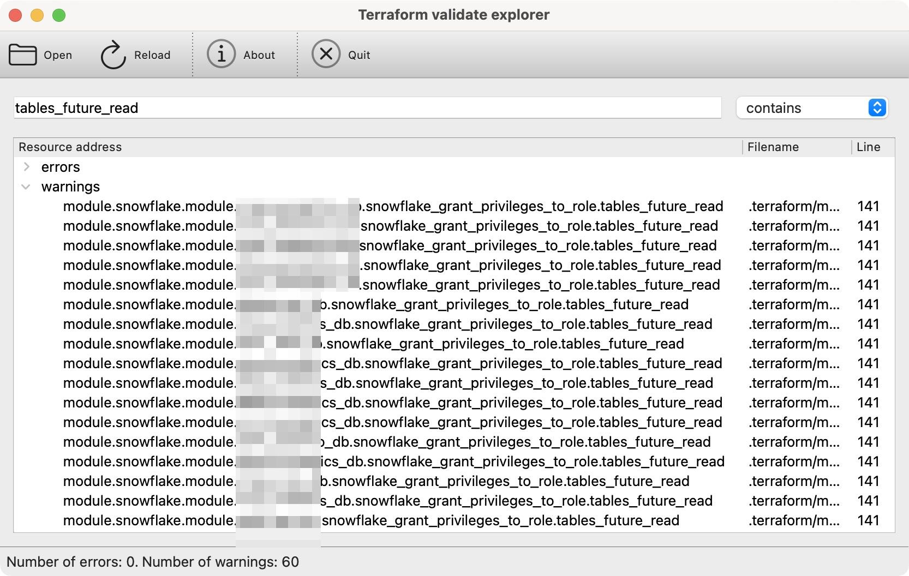
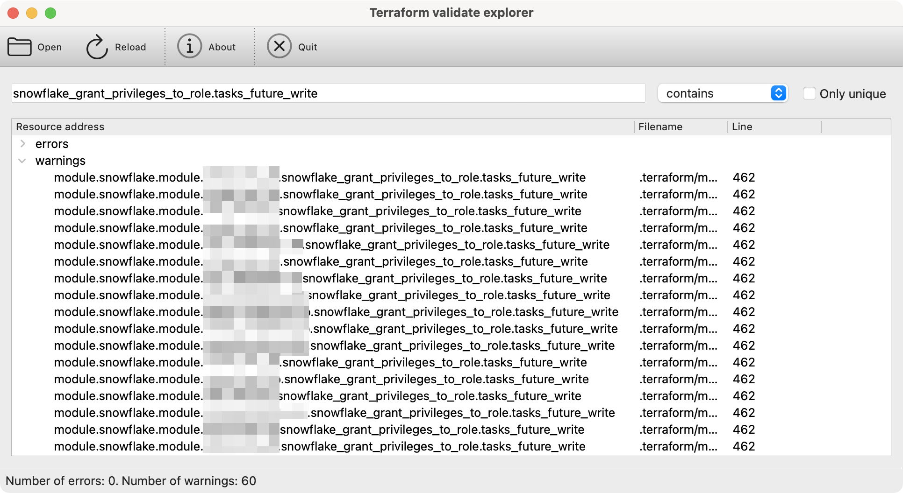
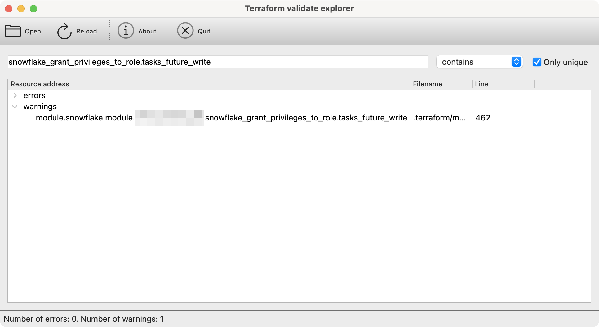

# terraform-validate-explorer


`terraform-validate-explorer` is a tool that helps you search and filter resource instances from the output file
generated by `terraform validate -json`. Those files can easily be longer than 50000 lines so filtering their contents
can be of help while upgrading Terraform provider versions and dealing with deprecated resources.

<!-- TOC -->
* [terraform-validate-explorer](#terraform-validate-explorer)
  * [Get it](#get-it)
    * [Prebuilt binaries](#prebuilt-binaries)
    * [From source](#from-source)
  * [Features](#features)
    * ["contains" filter](#contains-filter)
    * ["does not contain" filter](#does-not-contain-filter)
    * ["regex" filter](#regex-filter)
    * ["Only unique" toggle](#only-unique-toggle)
<!-- TOC -->

## Get it

### Prebuilt binaries

Look for a release binary for your operating system on the [Releases page](https://github.com/ivica-k/terraform-validate-explorer/releases).

### From source

No binary available? Clone this repository and:

```text
pip install -r requirements.txt
python main.py
```

## Features

### "contains" filter

Search for all resources that have `tables_future_read` in the name (Snowflake ["future" grants](https://docs.snowflake.com/en/sql-reference/sql/grant-privilege#future-grants-on-database-or-schema-objects)
are amazing btw!)



### "does not contain" filter

To verify that only `snowflake_` resources are deprecated, I filtered all the warnings that do not contain the word
`snowflake`:


### "regex" filter

If the other two filters are not cutting it for you, you can always do it with
[one of the worlds's write-only languages](https://blog.codinghorror.com/regular-expressions-now-you-have-two-problems/).

Suppose you want to look for a resource instance that has `future_` in the name, followed by a four-letter word that is
at the end of the resource name:


### "Only unique" toggle

This toggle works in combination with any filter to show only unique resource addresses. This feature is useful when 
validating many resources created by the same module.

What is a "unique resource address"? If the full resource address is `module.snowflake.module.my_infra.snowflake_grant_privileges_to_role.functions_future_read`,
then a unique resource address is `snowflake_grant_privileges_to_role.functions_future_read`. See below for an example.

Searching for `snowflake_grant_privileges_to_role.tasks_future_write` yields 60 warnings, but if you look closely - 
it is the _same resource_, from the _same module_, just used many times.



Toggling the "Only unique" checkbox reveals that it is in fact just one resource, defined in a single module.

